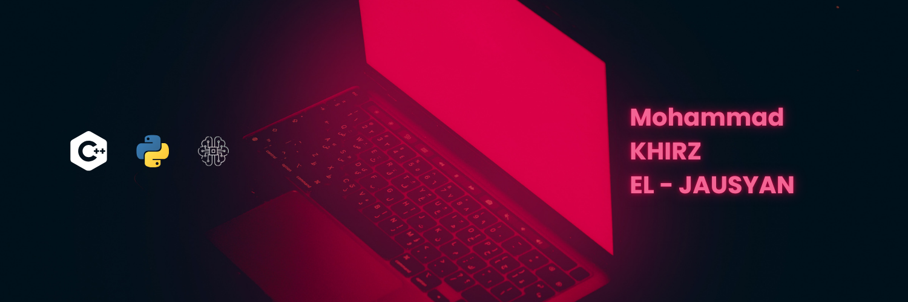

<h1 align="center">~ M K EL JAUSYAN ~</h1>

  

---

### 👨‍💻 Know me Deep

- 🎓 studying **Computer Engineering** at **Institut Teknologi Sepuluh Nopember (ITS)**.
- 🤖 **Robotics**, **Artificial Intelligence**, and **Embedded Systems**.
- 🛠️ working with **ROS**, **OpenCV**, **Python**, **C++**, and **Microcontrollers** like **STM32** and **Arduino**.
- 🚀 Currently exploring autonomous drones with **ROS 2**, **Gazebo**, and **MAVROS**.
- 🧠 Experienced in building object detection and control systems using **YOLO**, **OpenCV**, and custom hardware.

---

### 🧰 Tech Stack

---

### 📊 GitHub Stats

---

### 📫 Find Me 

- 🌐 [Portfolio Website](yan-sukses.github.io/jausyan.github.io/work.html)
- 💼 [LinkedIn](https://www.linkedin.com/in/el-jausyan-812928317/)
- 📧 Email: suksesjausyan@gmail.com

---

> “Stay curious, keep learning, and keep building cool stuff.” 🚀

<!---
jausyan-sukses/jausyan-sukses is a ✨ special ✨ repository because its `README.md` (this file) appears on your GitHub profile.
You can click the Preview link to take a look at your changes.
--->
